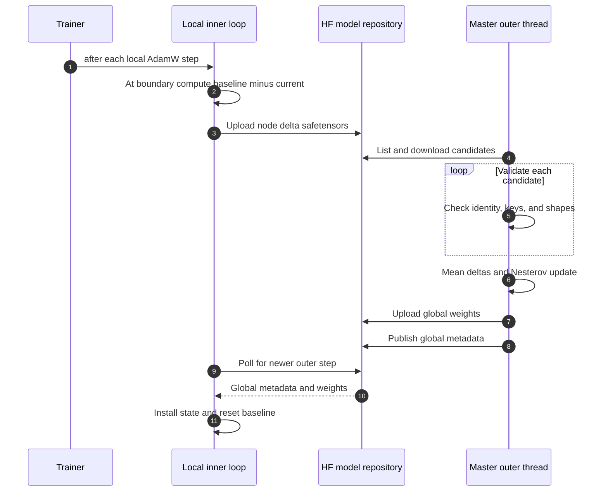

# DumbDiLoCo overview

DumbDiLoCo is Speedtronic's optional asynchronous distributed mode. Nodes train locally, upload pseudo-gradient deltas to a Hugging Face model repository, and periodically install newer global weights. A master aggregates deltas and publishes a new global model.

It does not use `torch.distributed`, NCCL, collectives, a parameter server, a shared clock, or straggler barriers.

## Topology



## Roles

| Role | Local training | Uploads deltas | Runs outer aggregation | Owns global state |
|---|---:|---:|---:|---:|
| `master` | Yes | Yes | Yes, background daemon thread | Yes |
| `worker` | Yes | Yes | No | No |
| `single` | N/A when disabled | No | No | No |

A master is also a local worker.

## Terminology

| Term | Meaning |
|---|---|
| Local step | One completed local AdamW update after accumulation |
| Inner step | Another name for a local optimizer update |
| Inner boundary | `local_step % inner_steps == 0` |
| Baseline | State at the last successful upload or global installation |
| Pseudo-gradient | `float32(baseline) - float32(current)` |
| Outer round | One successful master aggregation/publication |
| Outer step | Integer version in `global/step_count.json` |
| Global model | Complete cloned `state_dict` |
| Node delta | Floating/complex state deltas plus safetensors metadata |

## Minimal master config

```yaml
distributed:
  enabled: true
  mode: dumb_diloco
  role: master
  node_id: master-1
  collaborators: []
  repo_id: your-org/your-run
  token: null
  inner_steps: 500
  poll_interval: 60
  outer_lr: 0.7
  outer_momentum: 0.9
  state_dir: .speedtronic/diloco
  reset_inner_optimizer: true
  async_delta_upload: true
  async_global_poll: true
```

Prefer `HF_TOKEN` or another Hugging Face SDK credential mechanism over YAML tokens.

## Minimal worker config

```yaml
distributed:
  enabled: true
  mode: dumb_diloco
  role: worker
  node_id: worker-1
  repo_id: your-org/your-run
  token: null
  inner_steps: 500
  poll_interval: 60
  reset_inner_optimizer: true
```

Every participant needs a unique, explicit, path-safe node ID.

## Inner-loop lifecycle

At every optimizer step:

1. Trainer advances the local scheduler.
2. Coordinator receives the new local step.
3. On a boundary, compute a cumulative pseudo-gradient.
4. Upload the delta.
5. Poll for a newer global version.
6. Install compatible global state if available.
7. Return whether the trainer should reset optimizer state.

Between boundaries, polling occurs no more than once per `poll_interval`.

## Outer-loop lifecycle

The master outer thread:

1. Lists remote delta paths.
2. Downloads candidates.
3. Skips processed identities.
4. Validates keys and shapes.
5. Averages all valid deltas with equal weight.
6. Applies Nesterov momentum SGD.
7. Publishes full global weights.
8. Publishes outer-step metadata.
9. Saves local master state.
10. Notifies the training thread through a snapshot callback.

The training thread installs snapshots at normal post-step boundaries; the outer thread never mutates the model during a forward/backward operation.

## Hub repository layout

```text
<repo_id>/
├── global/
│   ├── latest.safetensors
│   └── step_count.json
└── nodes/
    ├── <node-a>/
    │   ├── delta_500.safetensors
    │   └── delta_1000.safetensors
    └── <node-b>/
        └── delta_500.safetensors
```

See [Hub Transport](./hub-transport) and [Tensor Format](./tensor-format) for exact fields.

## Asynchrony boundary

Only the master's outer aggregation runs in a background thread. Worker startup, polls, and uploads execute synchronously on the training thread. Hub retries can therefore delay a local loop even though nodes do not wait for stragglers or fixed rounds.

## v2 non-blocking transport

In 2.0, delta dispatch is asynchronous by default. The training thread snapshots state, computes the delta, and enqueues one immutable job; a daemon uploader performs Hub I/O. A second boundary skips and logs while a job is in flight. Global polling uses a separate background lane and installs downloaded state only on the training thread.

Set `async_delta_upload: false` and `async_global_poll: false` for the v1 synchronous behavior. See [Coordinator](./coordinator) and [migration](../v2/migration).


- All valid deltas in one poll receive equal weight.
- There is no staleness weighting, token weighting, participant weighting, or quorum.
- Deltas can be based on stale or unrelated global versions.
- Nodes do not coordinate a common membership snapshot.
- Non-floating buffers are published globally but excluded from deltas and outer updates.

## Checkpoint interaction

A local trainer checkpoint can include the coordinator baseline and the full master outer state. Worker restart behavior begins from the latest readable global model; exact mid-inner-loop recovery is not implemented.

## Security model

:::danger Trusted writers only

Any account with repository write access can replace global weights, deltas, metadata, or referenced files. There is no cryptographic node identity, signature, checksum binding, Byzantine defense, outlier rejection, or public-participation model.

:::

- Create and verify a private repository.
- Use a dedicated service account.
- Grant write access only to trusted workers.
- Use explicit unique node IDs.
- Protect local state/cache directories.
- Never place tokens in version-controlled YAML.
- Operate one active master for a repository.

## Current limitations

- Fixed global weight and metadata paths are separate uploads, not an atomic transaction.
- Historical deltas are never deleted.
- The master redownloads all listed candidates to inspect metadata before deduping.
- The processed-delta ledger is local, not published in Hub metadata.
- Multiple masters can overwrite each other.
- Nodes with the same seed can see identical data unless users provide different data/seed.
- Complex tensors are treated through float32 conversion rather than true complex arithmetic.
- A stopped coordinator can be started again by a later trainer call; bounded
  shutdown may leave a daemon Hub request running until it returns.

Continue with [Coordinator](./coordinator), [Hub Transport](./hub-transport), [Outer Loop](./outer-loop), and [Tensor Format](./tensor-format).
