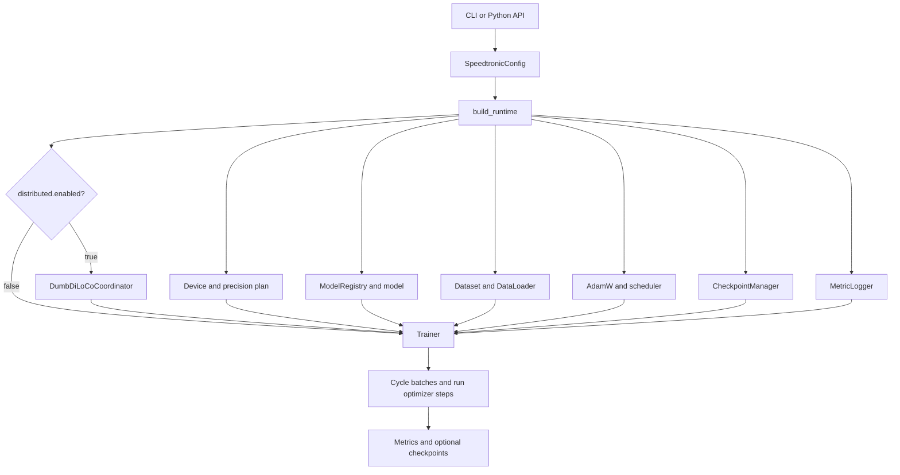

# Speedtronic

**GPU-agnostic PyTorch training, built for speed.**

Speedtronic 2.0.0 is an alpha, architecture-neutral Python training framework. A run is assembled from a validated configuration, a registered `torch.nn.Module`, a data source, AdamW or hybrid Muon, an optional scheduler, precision handling, checkpoints, metrics, and—optionally—a Hub-backed DumbDiLoCo coordinator.

:::info Documentation scope

This site documents every local implementation module, every top-level class and function, every method, the v1 and v2 repository tests, both shipped configurations, both examples, and the packaging surface. The [generated source inventory](/docs/reference/source-inventory) is rebuilt from the Python AST during the documentation build. Documentation coverage is not the same as runtime test coverage; see the [test map](/docs/appendix/test-map).

:::

## Capability map

| Area | What Speedtronic 2.0.0 provides |
|---|---|
| Devices | CPU, CUDA, and Apple MPS selection |
| Model contract | Any module following Speedtronic's loss/batch protocol |
| Reference model | Decoder-only transformer with RoPE, GQA, SwiGLU, RMSNorm, and tied embeddings |
| Optimization | AdamW, hybrid Muon/Muon+, cautious updates, gradient accumulation, clipping, warmup, cosine or constant schedule |
| Precision | FP32, FP16, BF16, CUDA `GradScaler`, fused-AdamW probing |
| Performance | Optional `torch.compile`, opt-in CUDA stream backprop, gradient checkpointing, worker prefetch, pinned memory |
| Data | Deterministic synthetic data, streamed UTF-8 text, serialized datasets, programmatic datasets |
| Persistence | Atomic local checkpoints with model/optimizer/scheduler/RNG/counters |
| Distributed | Asynchronous DumbDiLoCo over a Hugging Face model repository |
| Observability | Text/JSONL metrics plus callable, W&B, and TensorBoard hook adapters |

## One-minute path

1. [Install and run the CPU smoke test](/docs/getting-started/quickstart).
2. Read [core concepts](/docs/getting-started/core-concepts).
3. Choose a tutorial: custom model, custom data, performance, checkpointing, or observability.
4. Use the [configuration reference](/docs/reference/configuration) and [complete source inventory](/docs/reference/source-inventory) while integrating.

## System shape

## Documentation map

### Learn the system

- [Architecture](/docs/reference/architecture) explains composition, training order, and state ownership.
- [Runtime and Trainer](/docs/reference/runtime-and-trainer) documents the public training API and its contracts.
- [Configuration](/docs/reference/configuration) lists every field, default, normalization rule, and precedence edge case.

### Explore v2

- [v2 overview](/docs/v2)
- [Muon, Muon+, and cautious updates](/docs/v2/optimizers)
- [Out-of-order backprop scheduling](/docs/v2/scheduling)
- [Shape validation](/docs/v2/shape-validation)
- [Migration and deferred decisions](/docs/v2/migration)

### Build an integration

- [Custom models](/docs/tutorials/custom-model)
- [Custom data](/docs/tutorials/custom-data)
- [Observability hooks](/docs/tutorials/observability)
- [DumbDiLoCo](/docs/distributed/overview)

### Operate the framework

- [Testing](/docs/operations/testing)
- [Packaging](/docs/operations/packaging)
- [Troubleshooting](/docs/operations/troubleshooting)
- [Security and limitations](/docs/operations/security-and-limitations)

## Project identity

- Package/distribution name: `speedtronic`
- Version: `2.0.0`
- Python: `>=3.10`
- PyTorch: `>=2.1`
- License: Apache-2.0
- Default training device: `auto` → CUDA, then MPS, then CPU
- Default checkpoint directory: `<run.output_dir>/checkpoints`
- Distributed transport: Hugging Face model repository files
