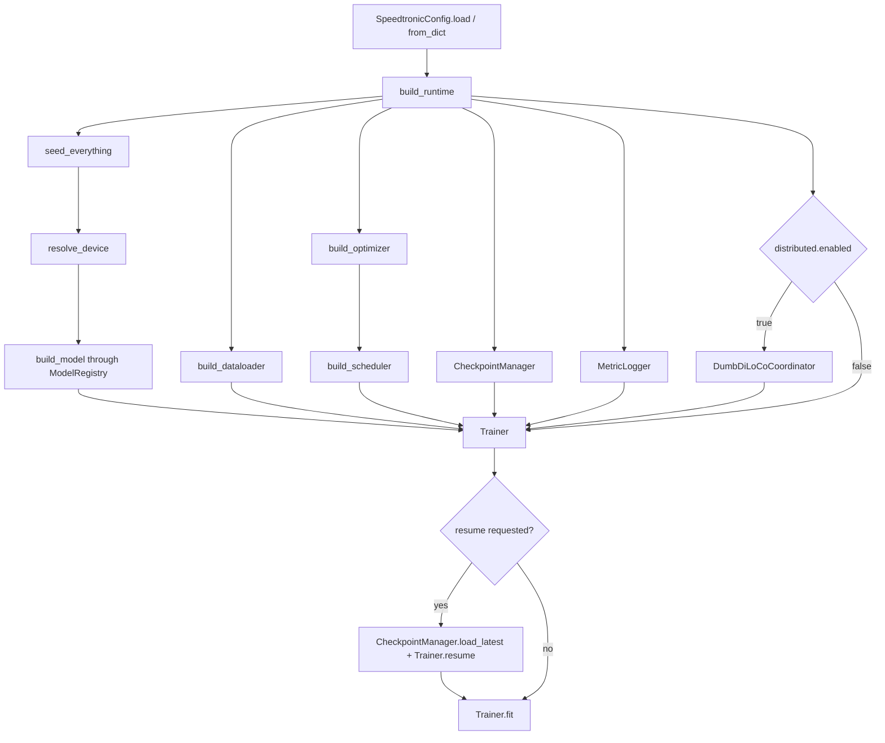
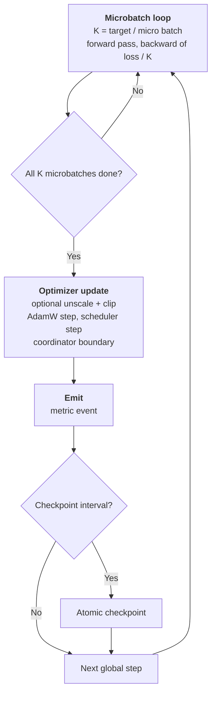
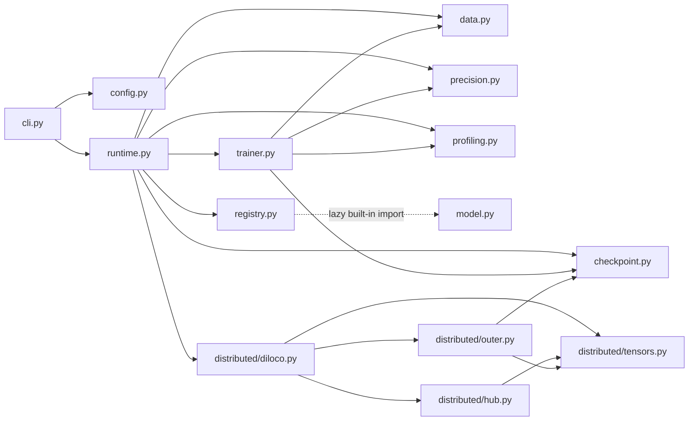

# System architecture

## Architectural goal

Speedtronic separates the training engine from a reference architecture. `Trainer` consumes a PyTorch module plus a small batch/output protocol; model construction is delegated to a registry. The bundled GPT-style model is an example and convenience, not a dependency of the loop.

## Composition root



`build_runtime()` returns both the `Trainer` and `CheckpointManager`. `train_from_config()` keeps only the trainer and immediately calls `fit()`.

## Runtime construction order

1. Convert a dictionary to `SpeedtronicConfig`; validate any config object.
2. Seed Python, NumPy, PyTorch CPU, and all CUDA devices.
3. Resolve `auto`, CPU, CUDA, or MPS.
4. Build the model through the process-global registry.
5. Build the data source and DataLoader.
6. Build AdamW, optionally probing fused mode.
7. Build a `LambdaLR` warmup/cosine or warmup/constant schedule.
8. Resolve checkpoint paths under `run.output_dir`.
9. Build the text/JSONL `MetricLogger`.
10. Construct the DumbDiLoCo coordinator when enabled.
11. Compute the effective global step target.
12. Construct the `Trainer`.
13. Load the latest local checkpoint when resume was requested.

## One global optimizer step



### Ordering guarantees

Within a global step, Speedtronic performs:

1. Complete forward/backward work for every microbatch.
2. One optimizer update.
3. One scheduler update.
4. One coordinator callback.
5. Optional optimizer-state reset.
6. One metric record.
7. Optional checkpoint write.

## Module dependency map



## Feature boundaries

### Architecture neutrality

The loop is architecture-neutral when the model follows its contracts. Configuration and factory argument passing are more transformer-oriented: `ModelConfig` carries vocabulary, context, layer, head, width, FFN, dropout, tying, and RoPE fields, and `build_model()` always passes those fields.

### Local versus distributed

`Trainer` has no knowledge of Hub details. It depends only on `SyncCoordinator`:

```python
class SyncCoordinator(Protocol):
    def start(self) -> None: ...
    def after_optimizer_step(self, model: Any, step: int) -> bool | None: ...
    def stop(self) -> None: ...
    def state_dict(self) -> dict[str, Any] | None: ...
    def load_state_dict(self, state: dict[str, Any]) -> None: ...
```

A truthy callback result asks the trainer to clear inner optimizer state when `distributed.reset_inner_optimizer` is enabled.

### Performance fallbacks

Capability-oriented features degrade rather than terminate local training:

- unsupported fused AdamW construction falls back to regular AdamW;
- `torch.compile` construction or runtime failure falls back to eager execution;
- missing/failing gradient-checkpointing hooks log a warning;
- Hub failures log and retry without terminating local training;
- unsupported explicit mixed precision generally falls back to FP32, with the CPU BF16 caveat documented on the [precision page](./precision).

## Failure boundaries

| Failure | Policy |
|---|---|
| Invalid configuration key/value | Raise `ConfigError` |
| Model/data/forward error | Propagate and stop the run |
| Checkpoint I/O error | Propagate |
| Metric hook error | Log warning and continue |
| Compile failure | Disable compiled path and retry eagerly |
| Fused AdamW failure | Use regular AdamW |
| Hub transient/permanent error | Retry, log, and usually continue local training |
| Resume with no checkpoint | Warn and start without restored state |

## v2 additions

- `optimizers.py` supplies role-aware Muon/AdamW routing, Newton–Schulz, Muon+, and cautious wrapping.
- `shapes.py` validates effective batch/model dimensions before optimization.
- `scheduling.py` assigns disjoint CUDA stage streams and falls back to sequential backward on CPU/MPS.
- DumbDiLoCo now dispatches Hub work through bounded background I/O lanes.

See the [v2 overview](/docs/v2) for the complete composition and compatibility notes.

## Source ownership

Every implementation file is mapped in the [generated source inventory](./generated-source-inventory). The curated [source coverage page](./source-inventory) explains what that inventory means.
