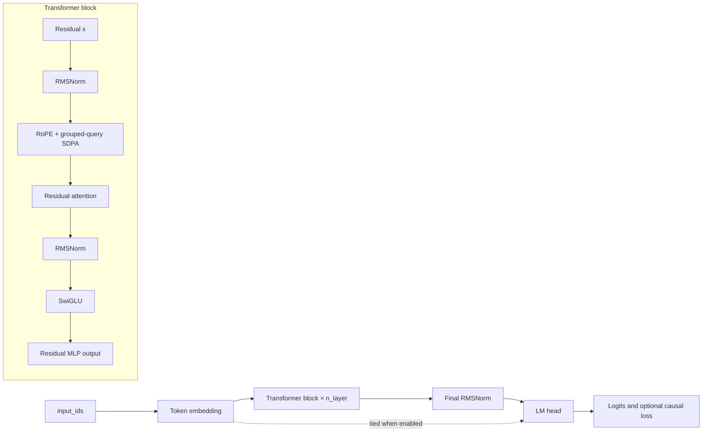

# Reference transformer

The bundled model is a compact decoder-only language model. It demonstrates the registry and trainer contracts but is not a requirement of the engine.

## Architecture



## `GPTConfig`

```python
GPTConfig(
    vocab_size=512,
    block_size=128,
    n_layer=4,
    n_head=8,
    n_kv_head=None,
    d_model=256,
    d_ff=None,
    dropout=0.0,
    tie_weights=True,
    rope_base=10_000.0,
)
```

`n_kv_head` defaults to `n_head`; `d_ff` defaults to `4 * d_model`. Dimensions must be positive, query heads must divide by KV heads, and `d_model` must divide by `n_head`.

## `RMSNorm`

```python
RMSNorm(dim, eps=1e-5)
```

Computes mean-square variance in FP32, normalizes in the input dtype, and applies a learned weight initialized to ones.

## Rotary embeddings

### `apply_rope(x, cos, sin)`

Applies rotate-half rotary embeddings to `(batch, heads, sequence, head_dim)`. Cosine and sine tensors broadcast as `(1, 1, sequence, head_dim)`.

### `RotaryEmbedding(head_dim, base=10_000.0)`

- Requires an even head dimension.
- Registers inverse frequencies as a non-persistent buffer.
- Caches cosine/sine tensors by sequence length, device, and dtype.
- Recomputes when device, dtype, or required length changes.

## `CausalSelfAttention`

```python
CausalSelfAttention(config)
```

Uses bias-free Q/K/V/output projections. Key/value width is `n_kv_head * (d_model // n_head)`.

Forward flow:

1. Project to `(B, T, heads, head_dim)` and transpose.
2. Apply RoPE to Q and K.
3. Repeat K/V heads to query-head count with `repeat_interleave`.
4. Use SDPA with `is_causal=True` when no mask is supplied.
5. If an attention mask exists, build a dense additive key-padding plus causal mask.
6. Merge heads, project, and apply residual dropout.

An explicit mask can force less efficient SDPA paths and consume `B × 1 × T × T` memory.

## `SwiGLU`

```python
SwiGLU(config)
```

Bias-free gate, up, and down projections:

```text
down(silu(gate(x)) * up(x))
```

The initial hidden width is `d_ff * 2/3`, rounded upward to a multiple of `n_head`. The comment calls this “head dimension,” but the code uses the number of heads rather than `d_model // n_head`.

## `TransformerBlock`

Pre-normalized residual block:

```text
x = x + dropout(attention(rms_norm(x)))
x = x + mlp(rms_norm(x))
```

Gradient checkpointing calls `torch.utils.checkpoint` with `use_reentrant=False`, with an older-signature fallback.

## `ReferenceTransformer`

Registered as:

```text
reference_transformer
gpt
```

Constructor aliases:

```text
max_seq_len → block_size
```

Accepted model fields:

```text
vocab_size, block_size, n_layer, n_head, n_kv_head,
d_model, d_ff, dropout, tie_weights, rope_base
```

Unknown keywords raise `TypeError`.

### Weight initialization

- Linear weights: normal mean 0, standard deviation 0.02.
- Linear biases: zero.
- Embedding weights: normal mean 0, standard deviation 0.02.

When weights are tied, the shared parameter is encountered through both the embedding and LM head during module traversal, so initialization consumes RNG twice.

### Gradient checkpointing hook

```python
model.set_gradient_checkpointing(True)
```

Propagates the flag to every block.

## Forward and loss

```python
model(
    input_ids,
    labels=None,
    attention_mask=None,
    **_,
) -> {"logits": tensor, "loss": optional_tensor}
```

- `input_ids` must be `(batch, sequence)`.
- Sequence length cannot exceed `block_size`.
- Labels must be same length or one shorter.
- Same-length labels are shifted to `labels[:, 1:]`.
- Logits are truncated to `[:, :-1]`.
- `-100` labels are ignored.
- Empty/all-ignored labels produce a differentiable zero.

:::warning Current causal alignment

The built-in synthetic/text datasets return one next-token label per input position. Speedtronic 2.0 consumes that already-shifted contract without shifting the labels a second time. Custom models should follow the same convention.

:::

## Compatibility aliases

```python
GPT = ReferenceTransformer
Transformer = ReferenceTransformer
ReferenceModel = ReferenceTransformer
GPTModel = ReferenceTransformer
TransformerConfig = GPTConfig
```

The top-level package lazily exports only `GPT`, `GPTConfig`, and `ReferenceTransformer`; the other aliases are available from `speedtronic.model`.

## GQA shape example

For `d_model=256`, `n_head=8`, and `n_kv_head=2`:

```text
head_dim = 32
query projection: 8 × 32 = 256
key/value projection: 2 × 32 = 64
repeat factor: 4
effective K/V heads: 8
```

## Custom model guidance

The model registry and trainer do not require this architecture. Follow the [custom model tutorial](../tutorials/custom-model), but remember that registry factories receive the fixed reference-model keyword set and the default config validates reference-oriented dimensions.
