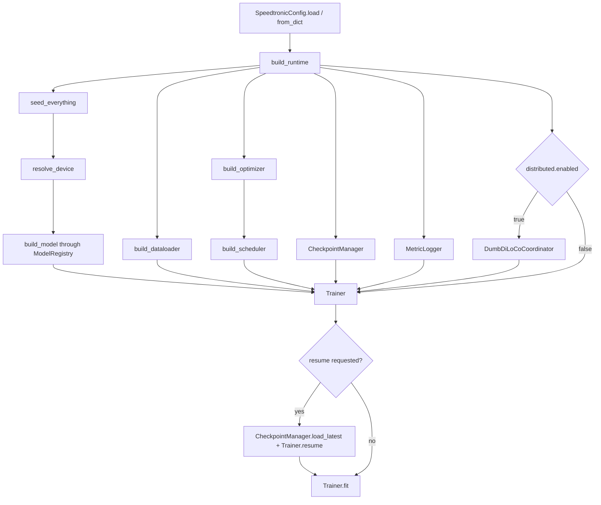
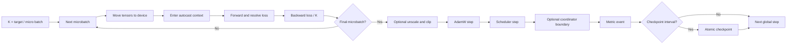
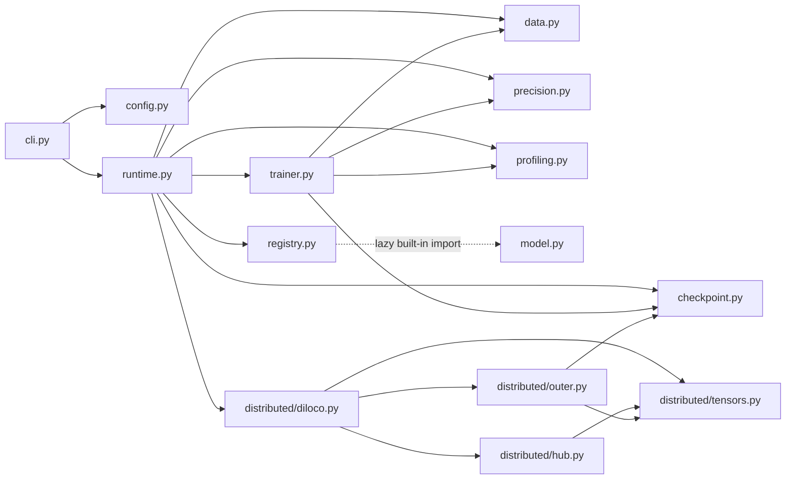
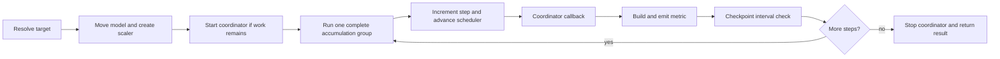

## System Architecture

_End-to-end composition, training flow, module dependencies, and state ownership in Speedtronic._
### Architectural goal

Speedtronic separates the training engine from a reference architecture. `Trainer` consumes a PyTorch module plus a small batch/output protocol; model construction is delegated to a registry. The bundled GPT-style model is an example and convenience, not a dependency of the loop.

### Composition root



`build_runtime()` returns both the `Trainer` and `CheckpointManager`. `train_from_config()` keeps only the trainer and immediately calls `fit()`.

### Runtime construction order

1. Convert a dictionary to `SpeedtronicConfig`; validate any config object.
2. Seed Python, NumPy, PyTorch CPU, and all CUDA devices.
3. Resolve `auto`, CPU, CUDA, or MPS.
4. Build the model through the process-global registry.
5. Build the data source and DataLoader.
6. Build AdamW, optionally probing fused mode.
7. Build a `LambdaLR` warmup/cosine or warmup/constant schedule.
8. Resolve checkpoint paths under `run.output_dir`.
9. Build the text/JSONL `MetricLogger`.
10. Construct the DumbDiLoCo coordinator when enabled.
11. Compute the effective global step target.
12. Construct the `Trainer`.
13. Load the latest local checkpoint when resume was requested.

### One global optimizer step



#### Ordering guarantees

Within a global step, Speedtronic performs:

1. Complete forward/backward work for every microbatch.
2. One optimizer update.
3. One scheduler update.
4. One coordinator callback.
5. Optional optimizer-state reset.
6. One metric record.
7. Optional checkpoint write.

### Module dependency map



### Feature boundaries

#### Architecture neutrality

The loop is architecture-neutral when the model follows its contracts. Configuration and factory argument passing are more transformer-oriented: `ModelConfig` carries vocabulary, context, layer, head, width, FFN, dropout, tying, and RoPE fields, and `build_model()` always passes those fields.

#### Local versus distributed

`Trainer` has no knowledge of Hub details. It depends only on `SyncCoordinator`:

```python
class SyncCoordinator(Protocol):
    def start(self) -> None: ...
    def after_optimizer_step(self, model: Any, step: int) -> bool | None: ...
    def stop(self) -> None: ...
    def state_dict(self) -> dict[str, Any] | None: ...
    def load_state_dict(self, state: dict[str, Any]) -> None: ...
```

A truthy callback result asks the trainer to clear inner optimizer state when `distributed.reset_inner_optimizer` is enabled.

#### Performance fallbacks

Capability-oriented features degrade rather than terminate local training:

- unsupported fused AdamW construction falls back to regular AdamW;
- `torch.compile` construction or runtime failure falls back to eager execution;
- missing/failing gradient-checkpointing hooks log a warning;
- Hub failures log and retry without terminating local training;
- unsupported explicit mixed precision generally falls back to FP32, with the CPU BF16 caveat documented on the [precision page](references/precision-and-performance.md).

### Failure boundaries

| Failure | Policy |
|---|---|
| Invalid configuration key/value | Raise `ConfigError` |
| Model/data/forward error | Propagate and stop the run |
| Checkpoint I/O error | Propagate |
| Metric hook error | Log warning and continue |
| Compile failure | Disable compiled path and retry eagerly |
| Fused AdamW failure | Use regular AdamW |
| Hub transient/permanent error | Retry, log, and usually continue local training |
| Resume with no checkpoint | Warn and start without restored state |

### v2 additions

- `optimizers.py` supplies role-aware Muon/AdamW routing, Newton–Schulz, Muon+, and cautious wrapping.
- `shapes.py` validates effective batch/model dimensions before optimization.
- `scheduling.py` assigns disjoint CUDA stage streams and falls back to sequential backward on CPU/MPS.
- DumbDiLoCo now dispatches Hub work through bounded background I/O lanes.

See the [v2 overview](references/v2-overview-and-migration.md) for the complete composition and compatibility notes.

### Source ownership

Every implementation file is mapped in the [generated source inventory](references/api-inventory.md). The curated [source coverage page](references/project-structure.md) explains what that inventory means.


---

## Runtime and Trainer API

_Public composition helpers, Trainer lifecycle, model contracts, accumulation, feature fallback, resume, and metrics._
### Runtime functions

#### `seed_everything(seed: int) -> None`

Seeds:

- Python `random`;
- `PYTHONHASHSEED` in the current process environment;
- NumPy if it can be imported;
- PyTorch CPU;
- all CUDA devices when CUDA is available.

NumPy failures are ignored.

#### `build_optimizer(model, config, device) -> torch.optim.Optimizer`

Builds AdamW from `config.optimizer`:

```text
lr, betas, eps, weight_decay
```

When `optimizer.fused` is null, `supports_fused_adamw(device)` probes CUDA. A forced fused value is also attempted. `TypeError`, `RuntimeError`, or `ValueError` during construction falls back to ordinary AdamW.

#### `build_scheduler(optimizer, config) -> LambdaLR`

Creates warmup and either cosine or constant decay:

```text
warmup: max(1e-8, (step + 1) / warmup_steps)
constant: 1.0
cosine: min_ratio + (1 - min_ratio) * 0.5 * (1 + cos(pi * progress))
```

The scheduler advances once per global optimizer update, not per microbatch.

#### `build_logger(config) -> MetricLogger`

Maps `logging.level`, `file`, `json_file`, and `every_steps`. It does not attach hooks.

#### `build_runtime(...)`

```python
build_runtime(
    config: SpeedtronicConfig | dict[str, Any],
    *,
    resume: bool = False,
    device: str | torch.device | None = None,
    max_steps: int | None = None,
) -> tuple[Trainer, CheckpointManager]
```

The function validates, seeds, resolves hardware, and constructs every local component. If distributed mode is enabled, it also creates `DumbDiLoCoCoordinator`.

Effective target precedence:

```text
explicit build_runtime(max_steps=...)
→ data.max_steps
→ run.max_steps
```

The expression is implemented as `max_steps if provided else (data.max_steps or run.max_steps)`.

Resume lookup happens after the trainer is created. A missing checkpoint is a warning, not an error.

#### `train_from_config(...) -> TrainResult`

Builds the runtime and immediately calls `Trainer.fit()`.

Aliases:

```python
run = train_from_config
train = train_from_config
```

### `SyncCoordinator`

```python
@runtime_checkable
class SyncCoordinator(Protocol):
    def start(self) -> None: ...
    def after_optimizer_step(self, model: Any, step: int) -> bool | None: ...
    def stop(self) -> None: ...
    def state_dict(self) -> dict[str, Any] | None: ...
    def load_state_dict(self, state: dict[str, Any]) -> None: ...
```

`after_optimizer_step()` may return true to request inner optimizer state reset. DumbDiLoCo returns true after a successful upload **or** global installation.

### `TrainResult`

```python
@dataclass
class TrainResult:
    steps: int
    samples: int
    tokens: int
    final_loss: float | None
    elapsed_s: float
    metrics: list[dict[str, Any]]
```

| Field | Meaning |
|---|---|
| `steps` | Final absolute global step, including resumed state |
| `samples` | Cumulative sample counter |
| `tokens` | Cumulative token counter |
| `final_loss` | Mean final-update loss for this invocation, or null when no update ran |
| `elapsed_s` | Duration of this invocation |
| `metrics` | Every metric record generated by this invocation |

`metrics` grows on every step even when the logger suppresses output by cadence.

### `Trainer`

```python
Trainer(
    model,
    optimizer,
    dataloader,
    *,
    device,
    config=None,
    scheduler=None,
    precision=None,
    logger=None,
    checkpoint_manager=None,
    coordinator=None,
    max_steps=None,
    start_step=0,
)
```

The constructor:

- converts a dictionary config;
- stores the model/optimizer/loader/device;
- creates a default logger;
- resolves a precision plan when omitted;
- establishes cumulative counters;
- configures gradient checkpointing;
- optionally constructs `torch.compile(model)`.

Compatibility aliases:

```python
TrainingEngine = Trainer
SpeedtronicTrainer = Trainer
```

### Batch movement and counting

`_move_batch()` recursively transfers tensors in dictionaries, tuples, and lists to the selected device with `non_blocking=True`.

`_batch_size_and_tokens()` chooses:

- dictionary `input_ids`, then `inputs`; or
- the first tuple/list field.

For a multi-dimensional dictionary input with `attention_mask`, tokens equal the mask sum. Unsupported values report one sample and one token.

### Loss resolution

#### Mapping output

- `{"loss": tensor}` uses the loss directly.
- `{"logits": 3d_tensor}` without loss triggers trainer-side causal cross-entropy.

#### Tensor output

A bare tensor is a direct loss, even if it is 3-D.

#### Tuple/list output

- A scalar first tensor is a direct loss.
- A 3-D first tensor is treated as causal logits when labels have compatible shapes.

#### Inferred causal loss

For logits `(B, T, V)`:

- same-length labels are treated as already next-token aligned and use the full
  logit row;
- logits are truncated to `logits[:, :-1]` only for `(B, T-1)` labels;
- `-100` is ignored;
- all-ignored labels produce a differentiable zero tied to the logits.

The bundled datasets and the bundled model share this one-label-per-position
contract, so the first target is not skipped.

### Accumulation and optimization

For `K = accumulation_steps`:

1. Run each of K microbatches.
2. Mean any non-scalar loss.
3. Backpropagate `loss / K` immediately.
4. On the final microbatch, optionally unscale and clip.
5. Perform one optimizer update.
6. Clear gradients with `set_to_none=True`.

The reported loss is the arithmetic mean of the K unscaled microbatch losses.

### Feature setup

#### Gradient checkpointing

If enabled, the trainer calls:

```python
model.set_gradient_checkpointing(True)
```

A missing hook, attribute error, or any hook exception logs a warning and continues.

#### Compilation

`torch.compile` construction failure leaves the eager model active. Any exception from a compiled forward disables compilation and reruns that batch eagerly. The fallback is broad: it can hide a non-compilation model exception if eager execution succeeds.

### Global-step lifecycle



The target is `max(self.step, requested_target)`. `fit()` always calls coordinator `stop()` in `finally`, even on failure.

### `fit(max_steps=None) -> TrainResult`

1. Validate positive target.
2. Move model to the device.
3. Select original or compiled model.
4. Create a new `GradScaler` and restore deferred scaler state.
5. Zero gradients.
6. Capture invocation start time/counters.
7. Wrap loader in `infinite_batches`.
8. Start coordinator if needed.
9. Apply deferred coordinator checkpoint state after startup.
10. Emit `train_start`.
11. Run complete global steps.
12. Emit `train_end` and return.

`Trainer.train` is an alias for `fit`.

### Resume

`Trainer.resume(state)` immediately restores:

- model state;
- optimizer state;
- scheduler state;
- global step/sample/token counters;
- RNG state.

Scaler and coordinator state are staged for `fit()`; v2 coordinators can apply
prepared baseline state during startup before any remote refresh.

Saved precision and config copies are informational; they are not compared with or applied to the current runtime.

### Per-step metrics

| Key | Meaning |
|---|---|
| `step` | New cumulative step |
| `loss` | Mean microbatch loss |
| `lr` | First parameter-group LR after scheduler advancement |
| `steps_per_sec` | Invocation-local step rate |
| `samples_per_sec` | Invocation-local sample rate |
| `tokens_per_sec` | Invocation-local token rate |
| `samples` | Cumulative samples |
| `tokens` | Cumulative tokens |
| `micro_batches` | Microbatches in this update |

The reported LR is one scheduler position ahead of the LR that produced the just-completed update.

### v2 integration

`build_runtime()` resolves precision, validates startup shapes, builds AdamW or hybrid Muon, and passes a resolved `PrecisionPlan` to the trainer. The trainer starts the opt-in conservative CUDA stage scheduler when `ooo_backprop` is enabled and removes its hooks when the fit ends.

See [v2 optimizers](references/optimizers.md), [out-of-order backprop](references/scheduling-and-shapes.md), and [shape validation](references/scheduling-and-shapes.md).

### Important caveats


- A `GradScaler` may skip an overflowing optimizer update; the trainer emits an
  event and keeps the global step unchanged for that attempt.
- The trainer explicitly switches the model to `train()` mode before fitting.
- `fit()` creates a new scaler each invocation.
- A stopped v2 coordinator resets its started flag; a later `fit()` can start
  fresh background lanes, subject to the bounded shutdown timeout.
- A compile runtime failure reruns the same batch eagerly, which can duplicate side effects.
- Every per-microbatch loss is copied to CPU, synchronizing CUDA on each microbatch.

The [generated source inventory](references/api-inventory.md) lists all private methods and exact AST-derived signatures.
