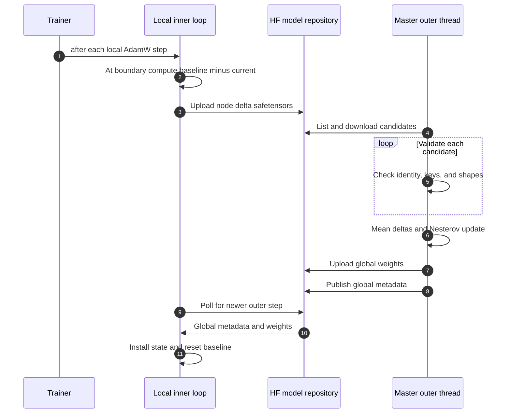

## DumbDiLoCo Overview

_Hub-backed asynchronous distributed training concepts, topology, trust model, and lifecycle._
DumbDiLoCo is Speedtronic's optional asynchronous distributed mode. Nodes train locally, upload pseudo-gradient deltas to a Hugging Face model repository, and periodically install newer global weights. A master aggregates deltas and publishes a new global model.

It does not use `torch.distributed`, NCCL, collectives, a parameter server, a shared clock, or straggler barriers.

### Topology



### Roles

| Role | Local training | Uploads deltas | Runs outer aggregation | Owns global state |
|---|---:|---:|---:|---:|
| `master` | Yes | Yes | Yes, background daemon thread | Yes |
| `worker` | Yes | Yes | No | No |
| `single` | N/A when disabled | No | No | No |

A master is also a local worker.

### Terminology

| Term | Meaning |
|---|---|
| Local step | One completed local AdamW update after accumulation |
| Inner step | Another name for a local optimizer update |
| Inner boundary | `local_step % inner_steps == 0` |
| Baseline | State at the last successful upload or global installation |
| Pseudo-gradient | `float32(baseline) - float32(current)` |
| Outer round | One successful master aggregation/publication |
| Outer step | Integer version in `global/step_count.json` |
| Global model | Complete cloned `state_dict` |
| Node delta | Floating/complex state deltas plus safetensors metadata |

### Minimal master config

```yaml
distributed:
  enabled: true
  mode: dumb_diloco
  role: master
  node_id: master-1
  collaborators: []
  repo_id: your-org/your-run
  token: null
  inner_steps: 500
  poll_interval: 60
  outer_lr: 0.7
  outer_momentum: 0.9
  state_dir: .speedtronic/diloco
  reset_inner_optimizer: true
  async_delta_upload: true
  async_global_poll: true
```

Prefer `HF_TOKEN` or another Hugging Face SDK credential mechanism over YAML tokens.

### Minimal worker config

```yaml
distributed:
  enabled: true
  mode: dumb_diloco
  role: worker
  node_id: worker-1
  repo_id: your-org/your-run
  token: null
  inner_steps: 500
  poll_interval: 60
  reset_inner_optimizer: true
```

Every participant needs a unique, explicit, path-safe node ID.

### Inner-loop lifecycle

At every optimizer step:

1. Trainer advances the local scheduler.
2. Coordinator receives the new local step.
3. On a boundary, compute a cumulative pseudo-gradient.
4. Upload the delta.
5. Poll for a newer global version.
6. Install compatible global state if available.
7. Return whether the trainer should reset optimizer state.

Between boundaries, polling occurs no more than once per `poll_interval`.

### Outer-loop lifecycle

The master outer thread:

1. Lists remote delta paths.
2. Downloads candidates.
3. Skips processed identities.
4. Validates keys and shapes.
5. Averages all valid deltas with equal weight.
6. Applies Nesterov momentum SGD.
7. Publishes full global weights.
8. Publishes outer-step metadata.
9. Saves local master state.
10. Notifies the training thread through a snapshot callback.

The training thread installs snapshots at normal post-step boundaries; the outer thread never mutates the model during a forward/backward operation.

### Hub repository layout

```text
<repo_id>/
├── global/
│   ├── latest.safetensors
│   └── step_count.json
└── nodes/
    ├── <node-a>/
    │   ├── delta_500.safetensors
    │   └── delta_1000.safetensors
    └── <node-b>/
        └── delta_500.safetensors
```

See [Hub Transport](references/distributed.md) and [Tensor Format](references/distributed.md) for exact fields.

### Asynchrony boundary

Only the master's outer aggregation runs in a background thread. Worker startup, polls, and uploads execute synchronously on the training thread. Hub retries can therefore delay a local loop even though nodes do not wait for stragglers or fixed rounds.

### v2 non-blocking transport

In 2.0, delta dispatch is asynchronous by default. The training thread snapshots state, computes the delta, and enqueues one immutable job; a daemon uploader performs Hub I/O. A second boundary skips and logs while a job is in flight. Global polling uses a separate background lane and installs downloaded state only on the training thread.

Set `async_delta_upload: false` and `async_global_poll: false` for the v1 synchronous behavior. See [Coordinator](references/distributed.md) and [migration](references/v2-overview-and-migration.md).


- All valid deltas in one poll receive equal weight.
- There is no staleness weighting, token weighting, participant weighting, or quorum.
- Deltas can be based on stale or unrelated global versions.
- Nodes do not coordinate a common membership snapshot.
- Non-floating buffers are published globally but excluded from deltas and outer updates.

### Checkpoint interaction

A local trainer checkpoint can include the coordinator baseline and the full master outer state. Worker restart behavior begins from the latest readable global model; exact mid-inner-loop recovery is not implemented.

### Security model

> **Danger** — Trusted writers only
>
>
> Any account with repository write access can replace global weights, deltas, metadata, or referenced files. There is no cryptographic node identity, signature, checksum binding, Byzantine defense, outlier rejection, or public-participation model.
>

- Create and verify a private repository.
- Use a dedicated service account.
- Grant write access only to trusted workers.
- Use explicit unique node IDs.
- Protect local state/cache directories.
- Never place tokens in version-controlled YAML.
- Operate one active master for a repository.

### Current limitations

- Fixed global weight and metadata paths are separate uploads, not an atomic transaction.
- Historical deltas are never deleted.
- The master redownloads all listed candidates to inspect metadata before deduping.
- The processed-delta ledger is local, not published in Hub metadata.
- Multiple masters can overwrite each other.
- Nodes with the same seed can see identical data unless users provide different data/seed.
- Complex tensors are treated through float32 conversion rather than true complex arithmetic.
- A stopped coordinator can be started again by a later trainer call; bounded
  shutdown may leave a daemon Hub request running until it returns.

Continue with [Coordinator](references/distributed.md), [Hub Transport](references/distributed.md), [Outer Loop](references/distributed.md), and [Tensor Format](references/distributed.md).


---

## DumbDiLoCo Coordinator

_Master/worker startup, baseline lifecycle, polling, uploads, state serialization, and reset signaling._
### Public API

```python
from speedtronic import DumbDiLoCoCoordinator
# alias: DumbDiLoCo
```

Constructor:

```python
DumbDiLoCoCoordinator(
    config,
    model,
    *,
    hub=None,
    state_dir=None,
    logger=None,
)
```

`config` may be:

- `DistributedConfig`;
- a full `SpeedtronicConfig` exposing `.distributed`;
- a root mapping containing a `distributed` section.

The package-level `SyncResult` dataclass exists with `pushed`, `loaded_global`, and `outer_step`, but the current coordinator does not instantiate or return it.

### Node identity and paths

Identity resolution:

```text
config.node_id
→ HF_USERNAME
→ USER
→ "local"
```

Explicit IDs are config-validated. Environment-derived IDs are not revalidated.

State root:

```text
<state_root>/<node_id>/
```

`build_runtime()` resolves a relative `state_dir` under `run.output_dir`. The Hub `cache_dir` remains relative to the process working directory.

### Constructor state

The constructor captures an initial CPU baseline, initializes counters, and may create a `HubClient` or use an injected fake/transport.

Properties:

```python
coordinator.local_step
coordinator.last_global_step
coordinator.outer_step
```

### `start()`

The first call starts the role-specific lifecycle. `stop()` releases the
started flag after bounded shutdown, so a later `fit()` can start fresh
background lanes. If a Hub request outlives the timeout, its daemon thread
continues until the request returns and emits a shutdown warning.

#### Master startup

1. Attempt private repository creation with `exist_ok=True`.
2. Attempt `write` collaborator grants.
3. Construct `MasterOuterLoop`; this loads local master state.
4. Read remote global metadata.
5. Select local state, remote state, or bootstrap.
6. Start the background outer thread.

Repository and collaborator failures do not stop local training.

#### Worker startup

1. Read global metadata.
2. Download/install the referenced global if available.
3. Establish a new baseline.
4. Continue locally when metadata is absent or the read fails.

### Startup state selection

Let `L` be local outer step and `R` remote outer step.

| Condition | Selection |
|---|---|
| `L > 0` and remote unavailable or `R <= L` | Local global state wins |
| `R > L` | Remote model wins; outer state adopts it and resets momentum |
| `L = 0`, `R = 0` | Remote model is installed into the local model |
| No local state and no remote metadata | Bootstrap current model at outer step 0 |

Remote state does not contain processed deltas or Nesterov momentum.

### Global installation

`_install_state()` filters incoming tensors to keys present locally with identical shapes, then calls:

```python
model.load_state_dict(filtered, strict=False)
```

Missing keys, extra local keys, and shape mismatches are retained/ignored rather than raising. After installation, the complete local model becomes the new baseline.

### Polling

`after_optimizer_step(model, step)` verifies model identity, records local step, and computes:

```python
boundary = step % inner_steps == 0
```

At a boundary it uploads and force-polls. At other steps it polls only if `poll_interval` elapsed since the last poll.

Worker poll:

1. Read metadata.
2. Ignore versions `<= last_global_step`.
3. Use a cached per-version safetensors file when valid.
4. Delete and redownload a corrupt cache entry.
5. Install state and advance the baseline.

Master poll:

1. Read the outer loop's local snapshot under its lock.
2. Install it when newer.
3. Otherwise use the callback snapshot fallback.

### Delta upload

At an inner boundary:

```python
current = cpu_state_dict(model.state_dict())
delta = compute_pseudo_gradient(baseline, current)
hub.upload_delta(... base_outer_step=last_global_step ...)
```

Only after successful upload does the coordinator:

- set `_last_uploaded_step`;
- advance the baseline to `current`.

A failed upload leaves the baseline unchanged. The next boundary can therefore recompute a cumulative delta unless a global installation resets the baseline first.

### v2 asynchronous dispatch

With `async_delta_upload: true` (the v2 default), a boundary copies the model
state, computes the pseudo-gradient, and calls `put_nowait` on a one-slot
queue. The uploader thread performs serialization and Hub retries. The next
optimizer step is not held behind that network call. A second boundary while
the slot is occupied returns without waiting and emits
`delta_upload_skipped`.

A successful completion advances the baseline to the immutable target
snapshot only when the baseline generation is unchanged. A failed upload
leaves the baseline in place, so the next accepted boundary can send a
cumulative delta. A global installation increments the generation and prevents
an older in-flight completion from overwriting the new baseline.

`async_global_poll: true` submits metadata/state fetches to a separate worker.
The uploader/poll workers never mutate the live model; global state is
installed at the next training-thread callback.

### Optimizer-reset signal


The method returns:

```python
pushed or loaded
```

The trainer variable is named `weights_replaced`, but a true return can mean either:

- a delta upload succeeded; or
- newer global state was installed.

When `reset_inner_optimizer=true`, the trainer clears `optimizer.state` after any true result. This can occur mid-inner-loop after a global poll.

### State serialization

`state_dict()` returns:

```text
node_id
role
last_global_step
last_uploaded_step
local_step
baseline
pending_delta
pending_delta_step
outer (master only)
```

`pending_delta` and `pending_delta_step` are currently never populated by normal upload logic. `last_uploaded_step` is informational and does not suppress repeated uploads.

`load_state_dict()` restores counters, baseline, pending fields, and optional master outer state. It does not enforce that saved role/node ID matches the current process.

### Resume ordering caveat

The trainer:

1. calls `coordinator.start()`, which may install and baseline a fresh global;
2. then calls `coordinator.load_state_dict()` with deferred checkpoint state.

The checkpointed baseline can overwrite the baseline established by fresh global installation. On a worker resume, that can pair a newer model with an older baseline and produce a large unintended pseudo-gradient. This is a correctness limitation addressed by v2's prepared startup state.

### Stop behavior

`stop()` marks the coordinator stopped and asks the master outer thread to stop. It:

- does not force a partial delta;
- does not force a final outer sync;
- joins the thread for up to 10 seconds;
- does not clear `_started`.

A worker retains its latest local/global state. A master retains its local outer state after successful publication/save.

### Failure semantics

| Failure | Behavior |
|---|---|
| Initial repository/create/grant | Warning; local loop continues |
| Initial worker Hub read | Warning; local weights remain |
| Poll failure | Warning; model unchanged |
| Key/shape mismatch in delta | Error log; no upload |
| Upload failure | Warning; baseline not advanced |
| Corrupt local global cache | Delete and redownload |
| Wrong model passed to callback | `ValueError` stops training |

### Direct construction

```python
from speedtronic.config import DistributedConfig
from speedtronic.distributed import DumbDiLoCoCoordinator

config = DistributedConfig(
    enabled=True,
    role="worker",
    node_id="worker-1",
    repo_id="org/run",
)
coordinator = DumbDiLoCoCoordinator(config, model)
coordinator.start()
```

A real Hub token is resolved by the Hugging Face SDK; Speedtronic itself passes the configured token and does not define a separate token environment lookup.

Related: [Overview](references/distributed.md), [Outer Loop](references/distributed.md), and [Security](references/operations.md).


---

## Hub Transport

_HubClient API, retries, caching, repository operations, global publication, and delta upload format._
### Public API

```python
from speedtronic import HubClient
# distributed alias: HubTransport
```

Errors:

```python
HubError(RuntimeError)
HubUnavailable(HubError)
```

### Constructor

```python
HubClient(
    repo_id,
    *,
    token=None,
    cache_dir=None,
    api=None,
    retry_initial=1.0,
    retry_max=60.0,
    retry_attempts=6,
    sleeper=time.sleep,
)
```

`repo_id` is required. The client always treats it as a Hugging Face **model** repository. `api` and `sleeper` are injection points for tests.

The `api` property lazily constructs `huggingface_hub.HfApi(token=token)`. If the SDK is missing, operations raise `HubUnavailable`.

### Retry behavior

Every network/repository operation is wrapped by `_retry`:

```text
attempt immediately
→ wait retry_initial
→ double delay after each failure
→ cap at retry_max
→ raise HubUnavailable after retry_attempts
```

With defaults, sleeps are 1, 2, 4, 8, and 16 seconds before the sixth final attempt.

The wrapper catches every `Exception`, including permanent authentication, malformed request, and programming errors. There is no jitter, retry classification, or explicit request timeout.

### Repository methods

#### `create_repo(private=True)`

Calls:

```python
api.create_repo(
    repo_id,
    repo_type="model",
    private=private,
    exist_ok=True,
)
```

`exist_ok=True` does not verify that an existing repository is private.

#### `add_collaborator(username, permission="write")`

Valid permissions:

```text
read
write
admin
```

Attempts the newer keyword API, then a positional compatibility form. Missing SDK support raises `HubError`.

#### `list_files()`

Returns sorted repository filenames.

#### `file_exists(remote_path)`

Builds a set from `list_files()` and checks membership. This is a full repository listing, not a direct existence API.

#### `upload(local_path, remote_path)`

Verifies local existence and calls `api.upload_file` with compatibility handling.

#### `download(remote_path, local_path=None)`

1. Creates a temporary directory under `cache_dir`.
2. Uses an API download method when available, then the top-level SDK helper.
3. Copies the downloaded file to the destination.
4. Removes the temporary directory in `finally`.

The final copy is not atomic.

### JSON methods

#### `read_json(remote_path, default=None)`

Checks `file_exists`, downloads to `cache_dir/json/<remote_path>`, then parses JSON.

#### `write_json(remote_path, value)`

1. Writes pretty, sorted JSON under `cache_dir/outgoing`.
2. Uses one deterministic `.tmp` path.
3. Replaces the local staging file.
4. Uploads it.
5. Copies the local result into the read cache.

The deterministic temporary filename is not process-safe.

### Global metadata

```python
@dataclass(frozen=True)
class GlobalMetadata:
    outer_step: int
    updated_at: str
    model_file: str = "global/latest.safetensors"
```

`from_dict()` accepts legacy `step`, missing metadata defaults, and coerces values to int/str. `updated_at` is informational; synchronization decisions use `outer_step`.

#### `global_metadata()`

Attempts to read `global/step_count.json`. On `HubUnavailable`, it can fall back to cached JSON. It can also return cached metadata when the remote path is absent.

Malformed cached JSON is not converted into `HubUnavailable`.

### Global publication

```python
publish_global(
    state,
    *,
    outer_step,
    work_dir=None,
    updated_at=None,
    metadata_extra=None,
) -> GlobalMetadata
```

Publication sequence:

1. Save full state as local `latest.safetensors`.
2. Upload/overwrite `global/latest.safetensors`.
3. Construct metadata.
4. Write/upload `global/step_count.json`.
5. Return metadata.

Example:

```json
{
  "algorithm": "dumb_diloco",
  "model_file": "global/latest.safetensors",
  "optimizer": "nesterov_sgd",
  "outer_step": 7,
  "updated_at": "2026-01-01T12:00:00+00:00"
}
```

> **Caution** — Non-atomic fixed paths
>
>
> The model and metadata are separate overwrites of fixed paths. A reader can observe old metadata with a newly uploaded model. A metadata failure can leave new weights advertised under the old outer step.
>

#### `download_global(local_path, metadata=None)`

Uses `metadata.model_file` without an allow-list. Repository write access can redirect workers to another repo file.

### Delta publication

```python
upload_delta(
    state,
    *,
    node_id,
    local_step,
    base_outer_step,
    work_dir=None,
    metadata=None,
) -> str
```

Remote path:

```text
nodes/<node_id>/delta_<local_step>.safetensors
```

Safetensors metadata values are strings:

```json
{
  "algorithm": "dumb_diloco",
  "base_outer_step": "7",
  "local_step": "500",
  "node_id": "worker-1"
}
```

The outer loop derives node/local step from the path and reads `base_outer_step` from the header.

### `delta_paths()`

Returns all repository paths that start with `nodes/` and end in `.safetensors`. Parsing applies stricter path rules later.

### Local cache layout

```text
<cache_dir>/
├── downloads/<remote_path>
├── json/global/step_count.json
├── outgoing/global/step_count.json
└── speedtronic-download-<random>/   # temporary
```

The cache is not node-scoped and is not automatically rooted under run output.

### Failure behavior

All `_retry` failures become `HubUnavailable`. Higher coordinator layers usually catch and log those errors, allowing local training to continue. Because permanent errors are retried, an invalid token or repository name can consume the full backoff schedule on every operation.

### Security recommendations

- Use the SDK environment credential flow.
- Verify repository visibility after creation.
- Use one token with the minimum required scope.
- Restrict writer accounts.
- Do not treat `model_file` metadata as trusted input from an adversarial writer.
- Protect cache files from other local users.
- Monitor unexpected remote paths and updates.

Related: [Overview](references/distributed.md), [Outer Loop](references/distributed.md), and [Security](references/operations.md).


---

## Outer Optimizer and Master Loop

_Nesterov outer SGD, delta discovery, validation, aggregation, rollback, persistence, snapshots, and background polling._
### `NesterovOuterOptimizer`

```python
NesterovOuterOptimizer(
    state,
    lr,
    momentum=0.9,
)
```

Maintains CPU FP32 momentum buffers for floating/complex state keys.

#### `step(state, delta)`

For every delta key:

1. Require the key to exist in global state.
2. Require matching shape.
3. Skip non-floating/non-complex state.
4. Convert gradient to CPU FP32.
5. Update momentum:

```text
buffer = momentum * buffer + gradient
```

6. Compute:

```text
effective = gradient + momentum * buffer
```

7. Update in the global state's native dtype:

```text
state -= lr * effective
```

This matches PyTorch's Nesterov SGD formulation used by the repository test.

#### `state_dict()`

Returns cloned CPU momentum tensors only. Learning rate and momentum coefficient are not stored.

#### `load_state_dict(state)`

Replaces momentum buffers with cloned CPU FP32 tensors.

### `OuterState`

A dataclass exists:

```python
OuterState(
    global_state,
    outer_step=0,
    processed_deltas=set(),
    momentum={},
    last_error=None,
)
```

The current `MasterOuterLoop` stores equivalent fields directly and does not use this dataclass.

### `MasterOuterLoop`

```python
MasterOuterLoop(
    hub,
    state,
    *,
    node_state_dir,
    outer_lr=0.7,
    outer_momentum=0.9,
    poll_interval=60.0,
    on_global_update=None,
    logger=None,
)
```

Immediately clones the initial full state to CPU. Loading `outer_state.pt` replaces only matching same-shape tensors.

Properties:

```python
loop.processed_filenames
loop.state_path
loop.metadata_path
```

### Processed identity

```text
(node_id, local_step, base_outer_step)
```

Node and local step come from the path; base step comes from safetensors metadata.

`processed_filenames` reconstructs only node/local paths and cannot distinguish different base-step metadata for the same file.

### Candidate discovery

`_delta_candidates()` calls `hub.delta_paths()`, accepts paths parsed as:

```text
nodes/<node>/delta_<integer>.safetensors
```

and sorts them by node, local step, and full path.

### Delta download cache

Downloads are cached under:

```text
<state_dir>/cache/deltas/<basename>
```

The basename omits the node ID, so two nodes with the same local step share a local path. Current code downloads immediately before reading, limiting immediate collision impact, but the cache is not safely node-namespaced.

### One `sync_once()` round

Under one outer lock:

1. List and sort candidates.
2. Download every candidate.
3. Parse base outer step and construct identity.
4. Skip already processed identities.
5. Compute the expected floating/complex key set.
6. Require exact delta key-set equality.
7. Require matching shapes.
8. Log and skip unreadable/corrupt/incompatible files.
9. If no valid delta remains, emit an event and return.
10. Average all valid deltas in FP32.
11. Snapshot old global state, processed set, step, and momentum.
12. Apply one Nesterov outer update.
13. Increment outer step.
14. Add valid identities to the processed set.
15. Publish global state and metadata.
16. Save local outer state.
17. On publication/save failure, restore all in-memory snapshots and re-raise.
18. Invoke `on_global_update` with a cloned full state.
19. Emit `outer_step`.

The lock covers all network I/O, so snapshots from the training thread can block for a full round.

### Validation

A delta is accepted when:

- safetensors and metadata load;
- keys exactly match all floating/complex global-state keys;
- each shape matches.

The implementation does not validate:

- NaN/infinity;
- magnitude;
- staleness against the current outer step;
- path/header node identity agreement;
- algorithm marker;
- model/config hash;
- dtype compatibility;
- cryptographic publisher identity.

### Average

```python
average = sum(valid_deltas) / len(valid_deltas)
```

Every delta has equal weight. There is no participant, sample, token, age, or quality weighting.

### In-process rollback

If publishing or local persistence fails after in-memory mutation, the loop restores:

```text
global_state
outer_step
processed_deltas
Nesterov momentum
```

The remote publication may already have succeeded before a later local failure, so the rollback cannot undo remote side effects.

### Local master state

`outer_state.pt`:

```text
global_state
outer_step
processed_deltas
momentum
```

`outer_metadata.json`:

```text
outer_step
processed_deltas
updated_at
```

Both are written atomically through local temp-and-rename helpers. The JSON is diagnostic; the `.pt` file is authoritative.

### Remote recovery

`adopt_global_state()` installs a complete remote state and outer step. It can reset momentum. It does not learn the remote processed-delta ledger or Nesterov momentum.

A hard crash after remote publication but before local state persistence can cause the restarted master to aggregate already-published deltas again.

### Snapshot API

#### `snapshot()`

Under the lock, returns the outer step and a clone of the complete global state.

#### `start()`

Starts one daemon thread named `speedtronic-diloco-master` unless one is already alive.

#### Background loop

The thread calls `sync_once()` immediately, waits `poll_interval`, and repeats. Exceptions are logged and retried on the next interval.

#### `stop()`

Sets an event and joins for at most 10 seconds. It does not force a final synchronization and can return while network work is still running.

### `state_dict()` and `load_state_dict()`

`state_dict()` returns:

```text
outer_step
processed_deltas
momentum
global_state
```

`load_state_dict()` restores these values and writes the local state file as a side effect.

### Unbounded growth

The remote delta tree, processed ledger, per-version global cache, and redownload workload grow over time. There is no delta deletion, compaction, or protocol-level processed list.

### Multiple masters

No leader election, lease, or compare-and-swap protects global files. Multiple masters maintain independent momentum/processed sets and can overwrite the same paths with conflicting versions.

Related: [Overview](references/distributed.md), [Hub Transport](references/distributed.md), and [Tensor Format](references/distributed.md).


---

## Tensor and Wire Format

_CPU tensor normalization, safetensors I/O, pseudo-gradients, averaging, path parsing, and distributed file schema._
### `cpu_tensor(value)`

```python
value.detach().to(device="cpu").contiguous().clone()
```

This removes autograd history, transfers to CPU, makes contiguous layout, and clones storage. Cloning allows tied embedding/LM-head parameters to be serialized together, which safetensors rejects when they share memory.

### `cpu_state_dict(state)`

Applies `cpu_tensor()` to every value and stringifies keys.

### `save_safetensors(state, path, metadata=None)`

1. Creates parent directories.
2. Clones/normalizes every tensor.
3. Calls `safetensors.torch.save_file`.
4. Writes string metadata when supplied.

Integer and boolean state can be saved in global model files, but deltas exclude them.

### `load_safetensors(path)`

Calls `safetensors.torch.load_file(path, device="cpu")`.

### `read_metadata(path)`

Uses `safetensors.safe_open` to return safetensors header metadata as a string dictionary.

### `floating_state(state)`

Returns keys whose tensors are floating-point or complex.

### `compute_pseudo_gradient(baseline, current)`

Requirements:

- exact key-set equality;
- exact shape equality.

Output:

```text
float32(baseline) - float32(current)
```

for floating/complex keys. Non-floating keys are omitted. Any key or shape mismatch rejects the entire delta.

The sign is intentionally baseline minus current: local optimization moves from baseline toward current, so this is the outer direction to add to global weights.

### `average_deltas(deltas)`

- Rejects an empty list.
- Requires identical key sets.
- Uses the first delta's shapes as references.
- Accumulates in FP32.
- Divides by the number of deltas.

Dictionary key order is not significant.

### `parse_delta_path(path)`

Accepts exactly:

```text
nodes/<node_id>/delta_<integer>.safetensors
```

It splits on `/`, requires three segments, and parses the filename after removing `delta_` and `.safetensors`.

It does not validate that the file's embedded node ID and local step match the path.

### `load_delta(path)`

1. Reads safetensors metadata.
2. Loads tensor state.
3. Converts tensor-loading failures to `ValueError` with a stable message.

The outer loop catches that error, logs the filename, and skips the candidate.

### `metadata_json(metadata)`

Attempts to JSON-decode every metadata string. If any value is not valid JSON, it returns the original string dictionary. The current outer loop does not use this helper.

### Global model file

`global/latest.safetensors` contains the complete cloned `state_dict`:

- trainable parameters;
- floating buffers;
- integer/boolean buffers;
- other registered state entries.

No safetensors metadata accompanies the global model. Version information is in `global/step_count.json`.

### Global metadata file

```json
{
  "algorithm": "dumb_diloco",
  "model_file": "global/latest.safetensors",
  "optimizer": "nesterov_sgd",
  "outer_step": 12,
  "updated_at": "2026-01-01T12:00:00+00:00"
}
```

Bootstrap metadata adds:

```json
{"bootstrap": "true"}
```

Extra values are converted to strings.

### Node delta file

Path:

```text
nodes/<node_id>/delta_<local_step>.safetensors
```

Header:

```json
{
  "algorithm": "dumb_diloco",
  "base_outer_step": "11",
  "local_step": "500",
  "node_id": "worker-1"
}
```

Tensor payload:

```text
baseline - current
```

in FP32 for floating/complex state keys.

### Full remote tree

```text
<repo_id>/
├── global/
│   ├── latest.safetensors
│   └── step_count.json
└── nodes/
    ├── master-1/
    │   └── delta_500.safetensors
    ├── worker-1/
    │   ├── delta_500.safetensors
    │   └── delta_1000.safetensors
    └── worker-2/
        └── delta_500.safetensors
```

### Local coordinator tree

```text
<state_root>/<node_id>/
├── global/
│   └── latest-<outer_step>.safetensors
├── outgoing/
│   ├── latest.safetensors
│   └── <node_id>_delta_<step>.safetensors
└── cache/
    └── deltas/
        └── delta_<step>.safetensors
```

Master additionally stores:

```text
outer_state.pt
outer_metadata.json
```

### Compatibility rules

#### Model installation

Global installation is permissive:

- matching key/shape entries load;
- missing local/global keys are tolerated;
- shape mismatches are silently ignored.

#### Delta validation

Delta aggregation is strict:

- floating key set must match exactly;
- every shape must match;
- one bad delta is skipped in full.

There is no architecture/configuration fingerprint.

### Non-floating state

Non-floating entries:

- are published in global model files;
- are installed on workers;
- do not appear in deltas;
- do not receive outer updates.

Models with running integer counters or model-specific non-floating synchronization semantics need custom handling.

### Complex tensors

Complex keys pass floating-state checks, but arithmetic converts to FP32. Imaginary components are not preserved as true complex optimization. Real-valued models are the safe path.

### Safetensors safety

Safetensors protects the tensor container from arbitrary pickle code execution, but it does not authenticate writers, encrypt data, or validate numerical values.

Related: [Hub Transport](references/distributed.md), [Outer Loop](references/distributed.md), and [Security](references/operations.md).
