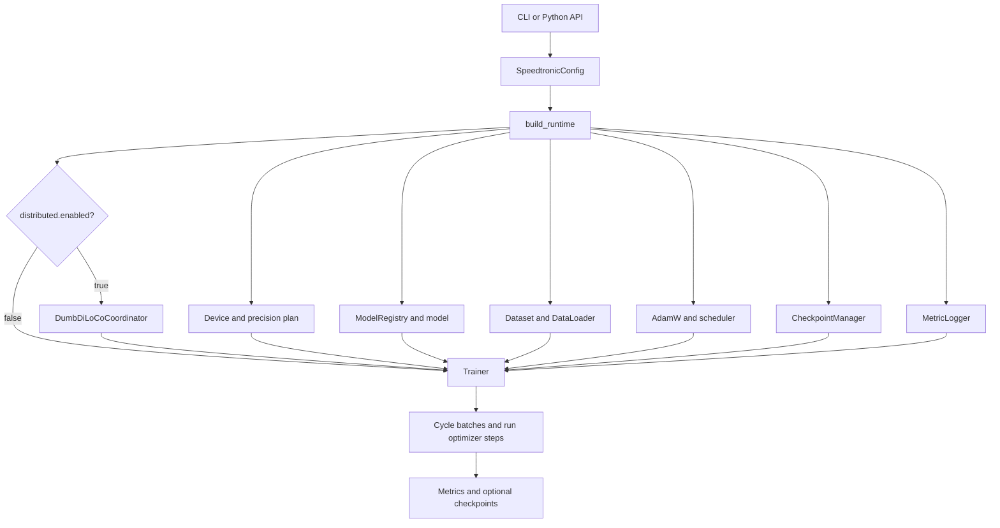

## Speedtronic Documentation

_Source-complete documentation for the Speedtronic 2.0.0 PyTorch training framework._
**GPU-agnostic PyTorch training, built for speed.**

Speedtronic 2.0.0 is an alpha, architecture-neutral Python training framework. A run is assembled from a validated configuration, a registered `torch.nn.Module`, a data source, AdamW or hybrid Muon, an optional scheduler, precision handling, checkpoints, metrics, and—optionally—a Hub-backed DumbDiLoCo coordinator.

> **Info** — Documentation scope
>
>
> This site documents every local implementation module, every top-level class and function, every method, the v1 and v2 repository tests, both shipped configurations, both examples, and the packaging surface. The [generated source inventory](references/project-structure.md) is rebuilt from the Python AST during the documentation build. Documentation coverage is not the same as runtime test coverage; see the [test map](references/glossary-and-tests.md).
>

### Capability map

| Area | What Speedtronic 2.0.0 provides |
|---|---|
| Devices | CPU, CUDA, and Apple MPS selection |
| Model contract | Any module following Speedtronic's loss/batch protocol |
| Reference model | Decoder-only transformer with RoPE, GQA, SwiGLU, RMSNorm, and tied embeddings |
| Optimization | AdamW, hybrid Muon/Muon+, cautious updates, gradient accumulation, clipping, warmup, cosine or constant schedule |
| Precision | FP32, FP16, BF16, CUDA `GradScaler`, fused-AdamW probing |
| Performance | Optional `torch.compile`, opt-in CUDA stream backprop, gradient checkpointing, worker prefetch, pinned memory |
| Data | Deterministic synthetic data, streamed UTF-8 text, serialized datasets, programmatic datasets |
| Persistence | Atomic local checkpoints with model/optimizer/scheduler/RNG/counters |
| Distributed | Asynchronous DumbDiLoCo over a Hugging Face model repository |
| Observability | Text/JSONL metrics plus callable, W&B, and TensorBoard hook adapters |

### One-minute path

1. [Install and run the CPU smoke test](references/getting-started.md).
2. Read [core concepts](references/getting-started.md).
3. Choose a tutorial: custom model, custom data, performance, checkpointing, or observability.
4. Use the [configuration reference](references/configuration.md) and [complete source inventory](references/project-structure.md) while integrating.

### System shape



### Documentation map

#### Learn the system

- [Architecture](references/architecture.md) explains composition, training order, and state ownership.
- [Runtime and Trainer](references/architecture.md) documents the public training API and its contracts.
- [Configuration](references/configuration.md) lists every field, default, normalization rule, and precedence edge case.

#### Explore v2

- [v2 overview](references/v2-overview-and-migration.md)
- [Muon, Muon+, and cautious updates](references/optimizers.md)
- [Out-of-order backprop scheduling](references/scheduling-and-shapes.md)
- [Shape validation](references/scheduling-and-shapes.md)
- [Migration and deferred decisions](references/v2-overview-and-migration.md)

#### Build an integration

- [Custom models](references/models-and-extensions.md)
- [Custom data](references/data.md)
- [Observability hooks](references/observability.md)
- [DumbDiLoCo](references/distributed.md)

#### Operate the framework

- [Testing](references/operations.md)
- [Packaging](references/operations.md)
- [Troubleshooting](references/operations.md)
- [Security and limitations](references/operations.md)

### Project identity

- Package/distribution name: `speedtronic`
- Version: `2.0.0`
- Python: `>=3.10`
- PyTorch: `>=2.1`
- License: Apache-2.0
- Default training device: `auto` → CUDA, then MPS, then CPU
- Default checkpoint directory: `<run.output_dir>/checkpoints`
- Distributed transport: Hugging Face model repository files


---

## Local Quickstart

_Install Speedtronic and run the bundled four-step CPU smoke configuration._
This path runs entirely from a source checkout. It uses synthetic data, does not download a model or dataset, and does not require Hugging Face credentials.

### Prerequisites

- Python 3.10 or newer
- PyTorch 2.1 or newer
- A writable checkout
- For CPU-only installation, install an appropriate PyTorch CPU wheel first when needed

### Install from source

```bash
cd /path/to/speedtronic
python3 -m venv .venv
. .venv/bin/activate
python -m pip install --upgrade pip
python -m pip install -e '.[dev]'
```

The package installs the `speedtronic` console command. The equivalent module entry point is:

```bash
python -m speedtronic --help
```

### Validate the configuration

```bash
speedtronic validate --config configs/smoke.yaml
```

Validation parses and normalizes configuration. It does **not** instantiate the model, open the selected data, resolve hardware, or run a forward pass.

The effective smoke configuration has these important properties:

| Property | Value |
|---|---|
| Target | 4 global optimizer steps |
| Model | 2-layer reference transformer, 66,880 parameters |
| Data | Deterministic synthetic token blocks |
| Microbatch | 1 sample |
| Target batch | 2 samples |
| Accumulation | 2 microbatches per optimizer update |
| Precision | FP32 |
| Device | `auto` in YAML; pass `--device cpu` to force it |
| Checkpoint interval | Every 2 steps |
| Retention | Last 2 checkpoints |

### Run four steps

```bash
speedtronic train --config configs/smoke.yaml --device cpu
```

A successful run ends with output similar to:

```text
completed steps=4 samples=8 tokens=256 loss=<value>
```

Loss is stochastic for synthetic input and initialization state, so the exact value is not contractual.

Artifacts are written beneath:

```text
runs/smoke/checkpoints/
├── latest.json
├── step_000000000002.pt
└── step_000000000004.pt
```

The pointer is:

```json
{"step": 4, "file": "step_000000000004.pt"}
```

### Resume semantics

`max_steps` is an absolute global target, not a count of additional work:

```bash
speedtronic train --config configs/smoke.yaml --device cpu --resume
```

If the newest checkpoint is at step 4, this invocation performs no optimizer updates. To demonstrate resume, use a temporary output directory, run two steps, then resume to four:

```bash
speedtronic train \
  --config configs/smoke.yaml \
  --device cpu \
  --output-dir runs/resume-demo \
  --max-steps 2

speedtronic train \
  --config configs/smoke.yaml \
  --device cpu \
  --output-dir runs/resume-demo \
  --max-steps 4 \
  --resume
```

The second command reports cumulative `steps=4`, even though it performed two updates.

### Python equivalent

```python
from speedtronic.runtime import train_from_config

result = train_from_config(
    {
        "run": {
            "name": "demo",
            "max_steps": 4,
            "device": "cpu",
            "output_dir": "runs/python-demo",
        },
        "model": {
            "name": "reference_transformer",
            "vocab_size": 128,
            "max_seq_len": 32,
            "n_layer": 2,
            "n_head": 4,
            "n_kv_head": 2,
            "d_model": 64,
            "d_ff": 128,
        },
        "data": {
            "micro_batch_size": 1,
            "target_batch_size": 2,
            "num_tokens": 32,
        },
        "precision": {"mode": "fp32"},
        "scheduler": {"warmup_steps": 1, "max_steps": 4},
    }
)

print(result.steps, result.samples, result.tokens, result.final_loss)
```

> **Tip** — Configure the scheduler horizon explicitly
>
>
> `SchedulerConfig.max_steps` defaults to 1000. When a shorter `run.max_steps` is
> set and the scheduler is left at that default, Speedtronic 2.0 automatically
> adopts the run target so the schedule ends with training. Set
> `scheduler.max_steps` explicitly when you want a horizon that differs from the
> run target.
>

### What the four steps execute

For each global step:

1. Fetch two synthetic microbatches.
2. Run each through the reference model in FP32.
3. Compute a causal-language-model loss.
4. Backpropagate each loss divided by two.
5. Clip only if `optimizer.grad_clip` is configured.
6. Perform one AdamW update.
7. Advance the cosine scheduler.
8. Emit `train_step` metrics.
9. Save a checkpoint at steps 2 and 4.

Continue with [core concepts](references/getting-started.md) or the [architecture reference](references/architecture.md).


---

## Core Concepts

_Understand configuration, microbatch accumulation, global steps, checkpoints, and DumbDiLoCo terminology._
### Configuration is the composition contract

`SpeedtronicConfig` is a tree of mutable dataclasses:

```text
SpeedtronicConfig
├── run
├── model
├── data
├── optimizer
├── scheduler
├── precision
├── checkpoint
├── logging
├── distributed
├── gradient_checkpointing
└── compile
```

The runtime composition root, `build_runtime()`, converts that declarative description into concrete objects. Configuration validation is deliberately structural and lightweight; it does not guarantee that a data path exists or that a custom model can train.

### Microbatch versus optimizer step

A loader emits `data.micro_batch_size` examples. The trainer consumes:

```text
accumulation_steps = target_batch_size / micro_batch_size
```

microbatches before one optimizer update. Every loss is divided by that count before backward propagation. The scheduler, global step counter, coordinator callback, and checkpoint cadence advance once per complete optimizer update.

If the final emitted microbatch is smaller than `micro_batch_size` and `drop_last=False`, the update can contain fewer than the nominal target batch.

### Absolute global steps

`run.max_steps`, `data.max_steps`, the `Trainer` constructor, and `Trainer.fit()` describe an absolute target:

```python
target_step = max(self.step, requested_target)
```

A trainer resumed at step 900 with a target of 1000 performs 100 steps. A trainer already at step 1000 performs none and returns `final_loss=None`.

### Model input contract

The built-in trainer recognizes two batch forms:

| Batch form | Forward call |
|---|---|
| `dict` | `model(**batch)` |
| `tuple` or `list` with at least two elements | `model(batch[0], batch[1])` |

The built-in causal loader emits:

```python
{
    "input_ids": LongTensor[batch, sequence],
    "labels": LongTensor[batch, sequence],
    "attention_mask": BoolTensor[batch, sequence],
}
```

A custom dataset that returns arbitrary dictionaries does not automatically receive a general-purpose collator; the bundled collator specifically understands causal dictionaries.

### Model output contract

A model can return:

- a scalar loss tensor;
- `{"loss": loss, ...}`;
- `{"logits": logits, ...}` plus compatible labels;
- a tuple/list whose first item is a loss;
- a tuple/list whose first item is 3-D causal logits.

A bare tensor is always interpreted as a loss, not logits. Extra metrics returned in an output mapping are not currently forwarded to `MetricLogger`.

### Precision resolution

`precision.mode: auto` means:

- CUDA with BF16 support → BF16;
- CUDA without BF16 support → FP16 plus `GradScaler`;
- CPU or MPS → FP32.

Explicit FP16 on CPU and mixed precision on MPS fall back to FP32. Unsupported BF16 on CUDA also falls back. Explicit CPU BF16 is not capability-checked by Speedtronic.

### Checkpoint versus distributed global state

A local trainer checkpoint contains model, optimizer, scheduler, scaler, counters, RNG, redacted config, and coordinator state. It is saved beneath the local filesystem.

DumbDiLoCo additionally maintains:

- a Hub-global model and outer step;
- a master's local processed-delta ledger and Nesterov momentum;
- per-node baselines and cached global files.

These are separate state domains. A worker restart begins from the latest global version it can read, not from an exact continuation of its DataLoader or partial inner loop.

### DumbDiLoCo vocabulary

| Term | Meaning in Speedtronic |
|---|---|
| Local step | One completed local AdamW optimizer update |
| Inner step | A local step; the name emphasizes that it belongs to the local objective |
| Inner boundary | `local_step % inner_steps == 0` |
| Baseline | Model state captured at the last successful upload or global installation |
| Pseudo-gradient | `baseline - current`; not an autograd gradient |
| Outer round | One successful master aggregation/publication |
| Outer step | Monotonic integer published in `global/step_count.json` |
| Node delta | Floating-state safetensors plus path/header metadata |
| Global model | Complete CPU-cloned `state_dict` published by the master |

### State ownership

| State | Primary owner | Local checkpoint | Hub |
|---|---|---:|---:|
| Parameters and buffers | `torch.nn.Module` | Yes | Global model |
| AdamW moments | `torch.optim.AdamW` | Yes | No |
| Scheduler | `LambdaLR` | Yes | No |
| CUDA scaler | `GradScaler` | Yes | No |
| Step/sample/token counters | `Trainer` | Yes | No |
| Global RNG | Python/NumPy/PyTorch | Yes | No |
| DataLoader position | PyTorch loader/workers | No | No |
| Global outer model | `MasterOuterLoop` | Master state | Yes |
| Processed deltas | `MasterOuterLoop` | Master state | No |
| Nesterov momentum | `MasterOuterLoop` | Master state | No |
| Worker baseline | Coordinator | Yes | No |

### Extension seams

- **Model factory:** `ModelRegistry` / `register_model`
- **Gradient checkpointing:** `model.set_gradient_checkpointing(enabled)`
- **Dataset and tokenizer:** `build_dataloader(dataset=..., tokenizer=...)`
- **Coordinator:** implement the `SyncCoordinator` protocol
- **Metrics:** callables or objects with `on_event(event, payload)`

See [architecture](references/architecture.md), [extensions](references/models-and-extensions.md), and [DumbDiLoCo](references/distributed.md).
