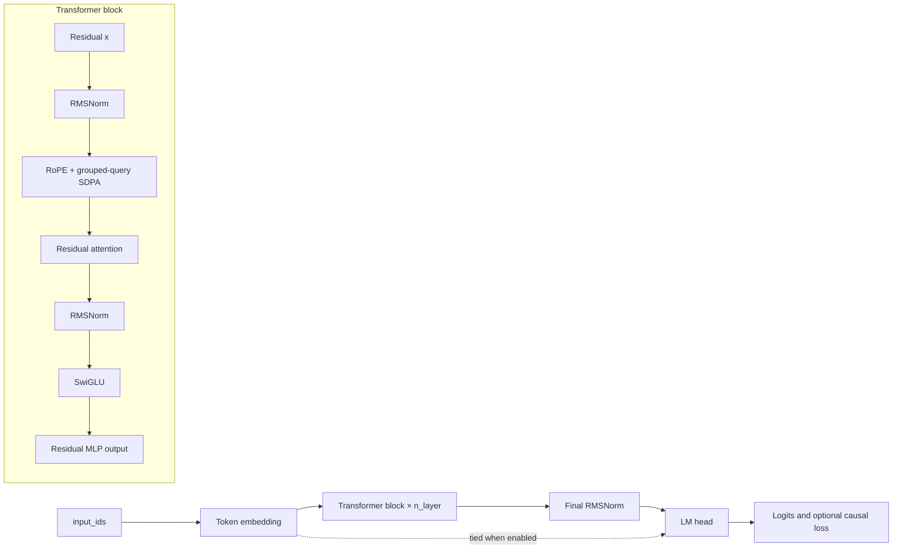

## Reference Transformer

_Architecture, tensor flow, RoPE, grouped-query attention, SwiGLU, RMSNorm, weight tying, and loss behavior._
The bundled model is a compact decoder-only language model. It demonstrates the registry and trainer contracts but is not a requirement of the engine.

### Architecture



### `GPTConfig`

```python
GPTConfig(
    vocab_size=512,
    block_size=128,
    n_layer=4,
    n_head=8,
    n_kv_head=None,
    d_model=256,
    d_ff=None,
    dropout=0.0,
    tie_weights=True,
    rope_base=10_000.0,
)
```

`n_kv_head` defaults to `n_head`; `d_ff` defaults to `4 * d_model`. Dimensions must be positive, query heads must divide by KV heads, and `d_model` must divide by `n_head`.

### `RMSNorm`

```python
RMSNorm(dim, eps=1e-5)
```

Computes mean-square variance in FP32, normalizes in the input dtype, and applies a learned weight initialized to ones.

### Rotary embeddings

#### `apply_rope(x, cos, sin)`

Applies rotate-half rotary embeddings to `(batch, heads, sequence, head_dim)`. Cosine and sine tensors broadcast as `(1, 1, sequence, head_dim)`.

#### `RotaryEmbedding(head_dim, base=10_000.0)`

- Requires an even head dimension.
- Registers inverse frequencies as a non-persistent buffer.
- Caches cosine/sine tensors by sequence length, device, and dtype.
- Recomputes when device, dtype, or required length changes.

### `CausalSelfAttention`

```python
CausalSelfAttention(config)
```

Uses bias-free Q/K/V/output projections. Key/value width is `n_kv_head * (d_model // n_head)`.

Forward flow:

1. Project to `(B, T, heads, head_dim)` and transpose.
2. Apply RoPE to Q and K.
3. Repeat K/V heads to query-head count with `repeat_interleave`.
4. Use SDPA with `is_causal=True` when no mask is supplied.
5. If an attention mask exists, build a dense additive key-padding plus causal mask.
6. Merge heads, project, and apply residual dropout.

An explicit mask can force less efficient SDPA paths and consume `B × 1 × T × T` memory.

### `SwiGLU`

```python
SwiGLU(config)
```

Bias-free gate, up, and down projections:

```text
down(silu(gate(x)) * up(x))
```

The initial hidden width is `d_ff * 2/3`, rounded upward to a multiple of `n_head`. The comment calls this “head dimension,” but the code uses the number of heads rather than `d_model // n_head`.

### `TransformerBlock`

Pre-normalized residual block:

```text
x = x + dropout(attention(rms_norm(x)))
x = x + mlp(rms_norm(x))
```

Gradient checkpointing calls `torch.utils.checkpoint` with `use_reentrant=False`, with an older-signature fallback.

### `ReferenceTransformer`

Registered as:

```text
reference_transformer
gpt
```

Constructor aliases:

```text
max_seq_len → block_size
```

Accepted model fields:

```text
vocab_size, block_size, n_layer, n_head, n_kv_head,
d_model, d_ff, dropout, tie_weights, rope_base
```

Unknown keywords raise `TypeError`.

#### Weight initialization

- Linear weights: normal mean 0, standard deviation 0.02.
- Linear biases: zero.
- Embedding weights: normal mean 0, standard deviation 0.02.

When weights are tied, the shared parameter is encountered through both the embedding and LM head during module traversal, so initialization consumes RNG twice.

#### Gradient checkpointing hook

```python
model.set_gradient_checkpointing(True)
```

Propagates the flag to every block.

### Forward and loss

```python
model(
    input_ids,
    labels=None,
    attention_mask=None,
    **_,
) -> {"logits": tensor, "loss": optional_tensor}
```

- `input_ids` must be `(batch, sequence)`.
- Sequence length cannot exceed `block_size`.
- Labels must be same length or one shorter.
- Same-length labels are shifted to `labels[:, 1:]`.
- Logits are truncated to `[:, :-1]`.
- `-100` labels are ignored.
- Empty/all-ignored labels produce a differentiable zero.

> **Warning** — Current causal alignment
>
>
> The built-in synthetic/text datasets return one next-token label per input position. Speedtronic 2.0 consumes that already-shifted contract without shifting the labels a second time. Custom models should follow the same convention.
>

### Compatibility aliases

```python
GPT = ReferenceTransformer
Transformer = ReferenceTransformer
ReferenceModel = ReferenceTransformer
GPTModel = ReferenceTransformer
TransformerConfig = GPTConfig
```

The top-level package lazily exports only `GPT`, `GPTConfig`, and `ReferenceTransformer`; the other aliases are available from `speedtronic.model`.

### GQA shape example

For `d_model=256`, `n_head=8`, and `n_kv_head=2`:

```text
head_dim = 32
query projection: 8 × 32 = 256
key/value projection: 2 × 32 = 64
repeat factor: 4
effective K/V heads: 8
```

### Custom model guidance

The model registry and trainer do not require this architecture. Follow the [custom model tutorial](references/models-and-extensions.md), but remember that registry factories receive the fixed reference-model keyword set and the default config validates reference-oriented dimensions.


---

## Models, Data, Modules, and Hooks

_Public extension seams for model factories, gradient checkpointing, datasets, coordinators, metric callbacks, and optional integrations._
### Model registry

#### `ModelRegistry`

```python
registry = ModelRegistry()
registry.register(name, factory=None)
registry.get(name)
registry.names()
registry.build(name, **kwargs)
```

`register()` works as a decorator or direct function. Registration silently overwrites an existing name.

#### Built-in lazy loading

The package-level global registry knows that `reference_transformer` and `gpt` are built-ins. If a name is absent, `get()` imports `speedtronic.model`; the model decorators then populate the **global** registry.

A newly constructed `ModelRegistry()` advertises built-in names through `names()` but importing the model does not register factories into that separate instance. Use the exported global `registry` for normal custom registration.

#### `register_model(name, factory=None)`

Public decorator/function backed by the global registry.

```python
import torch
from speedtronic import register_model

@register_model("my_model")
def make_model(**kwargs):
    return torch.nn.Linear(kwargs["d_model"], kwargs["vocab_size"])
```

#### `build_model(config, **overrides)`

Always forwards these fields:

```text
vocab_size
block_size
max_seq_len-derived model context
n_layer
n_head
n_kv_head
d_model
d_ff
dropout
tie_weights
rope_base
```

Explicit `overrides` replace standard fields. Custom factories should accept `**kwargs` or deliberately ignore unrelated reference-model parameters.

### Configuration-driven custom models

Unknown custom model-specific configuration keys are rejected. A model factory must obtain architecture-specific values inside Python or through the standard fields.

Registration is process-local. A CLI process loading only YAML has no plugin import mechanism and cannot discover a factory registered only in another process.

To make a CLI-visible model:

1. Put registration in an importable Python module.
2. Import that module before `build_runtime()`.
3. Construct the runtime programmatically, or add a supported plugin loader in the application.

### Trainer model contract

Accept a dictionary batch as keyword arguments or a tuple batch as `(inputs, labels)`. Return a direct loss, mapping with loss, or compatible causal logits. See [Runtime and Trainer](references/architecture.md).

### Gradient checkpointing convention

#### Model hook

```python
def set_gradient_checkpointing(self, enabled: bool = True):
    ...
```

The trainer calls the hook once during construction. Missing or failing hooks warn and continue.

#### Public helper

```python
from speedtronic import set_gradient_checkpointing

set_gradient_checkpointing(model, True)
```

`module_utils.set_gradient_checkpointing()` raises `AttributeError` when the model does not expose the hook, unlike the trainer's warning-only behavior.

### Dataset extension

Use:

```python
build_dataloader(config.data, dataset=my_dataset, tokenizer=my_tokenizer)
```

The built-in collator recognizes causal dictionaries, equal-width tuples/lists, and tensors. For other tasks, build a `DataLoader` directly and pass it to `Trainer`.

### Sync coordinator extension

Implement:

```python
class MyCoordinator:
    def start(self): ...
    def after_optimizer_step(self, model, step): ...
    def stop(self): ...
    def state_dict(self): ...
    def load_state_dict(self, state): ...
```

Contract details:

- `start()` is called only when work remains.
- `after_optimizer_step()` runs after the local scheduler step.
- A true result can clear optimizer state.
- `stop()` runs in `finally`.
- `state_dict()` is embedded in the next local checkpoint.
- `load_state_dict()` runs after coordinator startup.

### Metric hooks

A hook can be:

```python
def hook(event: str, payload: dict[str, Any]) -> None:
    ...
```

or an object with `on_event`. Hook failures do not stop training.

See [Observability](references/observability.md) for built-in W&B and TensorBoard adapters.

### Optional integrations

| Adapter | Dependency | Construction | Close behavior |
|---|---|---|---|
| `WandbHook` | `wandb` | Calls `wandb.init` | No public close method |
| `TensorboardHook` | TensorBoard writer | Creates `SummaryWriter` | Has `close()` |

Install with:

```bash
pip install 'speedtronic[logging]'
```

### Stability categories

| Category | Examples |
|---|---|
| Public top-level API | `SpeedtronicConfig`, `Trainer`, `register_model`, `HubClient` |
| Public module API | `build_dataloader`, `CheckpointManager`, tensor helpers |
| Compatibility alias | `GPT`, `TrainingEngine`, `DumbDiLoCo`, `HubTransport`, `Config` |
| Declarative but currently unused | `SyncResult`, `OuterState`, pending coordinator delta fields |
| Internal extension seam | `SyncCoordinator` protocol and model checkpoint hook |
| Private implementation | Names beginning with `_`; not stable API |

The [generated inventory](references/api-inventory.md) lists all of these declarations and source lines.


---

## Bring Your Own Model

_Register and train a model that follows Speedtronic's batch, loss, and gradient-checkpointing contracts._
The training loop is architecture-neutral. A custom model must follow the batch and loss protocols and be constructible through a registry factory.

### Step 1: Follow the batch contract

Dictionary batches are passed as keyword arguments. The bundled loader emits:

```text
input_ids
labels
attention_mask
```

A tuple/list batch is passed as:

```python
model(batch[0], batch[1])
```

### Step 2: Return a usable loss

The model can return:

```python
loss_tensor
```

```python
{"loss": loss_tensor, "auxiliary": ...}
```

```python
{"logits": logits, ...}
```

or a tuple/list whose first element is a loss or compatible 3-D logits.

A bare tensor is always interpreted as a loss, not logits.

### Step 3: Register a factory

```python
import torch
from torch import nn
from torch.nn import functional as F

from speedtronic import register_model


class SmallCausalLM(nn.Module):
    def __init__(self, vocab_size: int, d_model: int):
        super().__init__()
        self.embedding = nn.Embedding(vocab_size, d_model)
        self.output = nn.Linear(d_model, vocab_size)

    def forward(
        self,
        input_ids,
        labels=None,
        attention_mask=None,
    ):
        logits = self.output(self.embedding(input_ids))
        if labels is None:
            return {"logits": logits}

        if labels.shape[1] == input_ids.shape[1]:
            labels = labels[:, 1:]

        loss = F.cross_entropy(
            logits[:, :-1].reshape(-1, logits.shape[-1]),
            labels.reshape(-1),
            ignore_index=-100,
        )
        return {"logits": logits, "loss": loss}


@register_model("small_causal_lm")
def make_small_causal_lm(**kwargs):
    return SmallCausalLM(
        vocab_size=kwargs["vocab_size"],
        d_model=kwargs["d_model"],
    )
```

Factories receive the standard model fields even when they are unrelated to the custom architecture. Accepting `**kwargs` avoids accidental construction errors.

### Step 4: Train programmatically

```python
from speedtronic.runtime import train_from_config

result = train_from_config(
    {
        "run": {
            "max_steps": 10,
            "device": "cpu",
            "output_dir": "runs/small-lm",
        },
        "model": {
            "name": "small_causal_lm",
            "vocab_size": 128,
            "max_seq_len": 32,
            "n_layer": 2,
            "n_head": 4,
            "n_kv_head": 2,
            "d_model": 64,
        },
        "data": {
            "block_size": 32,
            "micro_batch_size": 2,
            "target_batch_size": 4,
        },
        "scheduler": {"warmup_steps": 1, "max_steps": 10},
        "precision": {"mode": "fp32"},
    }
)
```

### CLI limitation

Registry entries are in-memory. A separate `speedtronic train --config ...` process does not import arbitrary application registration code. YAML can select a registered name, but it cannot discover a Python factory by itself.

For a CLI-visible custom model, add an application-owned import/plugin mechanism and construct the runtime after registration.

### Non-language-model model

A model can ignore causal keys by accepting them explicitly and returning any differentiable scalar loss:

```python
class TinyRegressor(nn.Module):
    def __init__(self):
        super().__init__()
        self.value = nn.Parameter(torch.zeros(()))

    def forward(self, input_ids, labels=None, attention_mask=None):
        if labels is None:
            raise ValueError("labels are required")
        return (self.value - labels.float().mean()) ** 2
```

The built-in collator still produces language-model-shaped batches, so use a custom DataLoader for other batch structures.

### Direct Trainer injection

For complete control:

```python
from speedtronic.trainer import Trainer

trainer = Trainer(
    model,
    optimizer,
    dataloader,
    device="cpu",
    max_steps=100,
)
result = trainer.fit()
```

### Gradient checkpointing hook

```python
class MyModule(nn.Module):
    def set_gradient_checkpointing(self, enabled: bool = True):
        self.use_checkpointing = bool(enabled)
```

The trainer warns rather than fails if the hook is absent or raises.

### Model-returned metrics

The trainer currently discards additional output-dictionary metrics. If metrics are required, send them through a hook, a global collector, or a custom Trainer implementation.

### Checklist

- [ ] Model accepts the actual batch keys.
- [ ] Output begins with a differentiable loss under the trainer's interpretation.
- [ ] Factory accepts standard registry keywords.
- [ ] Registration occurs in the same process as runtime construction.
- [ ] Model context and data block sizes are compatible.
- [ ] Custom batch shapes have a matching collator.
- [ ] Gradient checkpointing exposes the optional hook.

Related: [Extensions](references/models-and-extensions.md), [Data](references/data.md), and [Runtime and Trainer](references/architecture.md).
